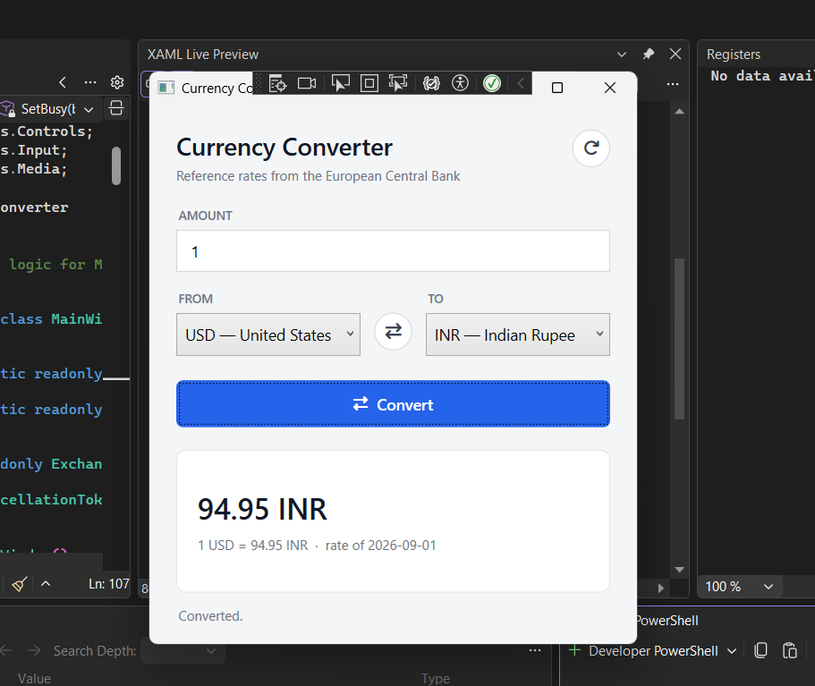

# Currency Converter

A small WPF desktop app for converting between currencies using live European Central Bank
reference rates.



## Download

[**Download CurrencyConverter.exe**](https://github.com/OWNER/REPO/releases/latest/download/CurrencyConverter.exe)
— Windows 64-bit · ~65 MB · nothing to install

The .NET runtime is bundled inside the executable, so it runs on a clean Windows machine with
no prerequisites. Download it, double-click, done.

> Because the executable is not code-signed, Windows SmartScreen will show
> *"Windows protected your PC"* the first time you run it. Click **More info → Run anyway**.
> Signing requires a paid code-signing certificate.

## Features

- Convert any amount between **30 currencies** published by the ECB.
- Live rates from the [Frankfurter API](https://frankfurter.dev) — no API key, no sign-up.
- One-click **swap** of the source and target currencies.
- Input filtering, so the amount box only accepts a valid number.
- Shows the unit rate and the date the rate was published, not just the total.
- **Works offline**: if the rate service is unreachable, the app falls back to a built-in
  list of ten common currencies and says so in the status bar instead of failing.

## Requirements

- Windows
- [.NET 10 SDK](https://dotnet.microsoft.com/download) or later

## Getting started

```bash
git clone <your-repo-url>
cd CurrencyConverter
dotnet run --project CurrencyConverter
```

Or open `CurrencyConverter.slnx` in Visual Studio 2022+ and press F5.

## Building a release

To produce the single self-contained `.exe` that the download link above points to:

```bash
dotnet publish CurrencyConverter -c Release -r win-x64 --self-contained true ^
  -p:PublishSingleFile=true ^
  -p:IncludeNativeLibrariesForSelfExtract=true ^
  -p:EnableCompressionInSingleFile=true
```

The result lands in `CurrencyConverter\bin\Release\net10.0-windows\win-x64\publish\`.

| Build | Size | Requires .NET installed? |
| --- | --- | --- |
| `--self-contained true` + compression | ~65 MB | no |
| `--self-contained true` | ~135 MB | no |
| `--self-contained false` | ~1.2 MB | yes — .NET 10 Desktop Runtime |

Compression roughly halves the download at the cost of a slightly slower first launch, while the
executable unpacks itself.

## Project structure

```
CurrencyConverter\
├─ README.md
├─ CurrencyConverter.slnx
├─ images\
│  └─ app.png                     screenshot used by this README
└─ CurrencyConverter\
   ├─ CurrencyConverter.csproj
   ├─ App.xaml / App.xaml.cs      application entry point
   ├─ MainWindow.xaml             the UI: layout, styles, icons
   ├─ MainWindow.xaml.cs          event handlers and UI state
   └─ ExchangeRateService.cs      rate lookup and the Currency / ConversionResult types
```

## How it works

`ExchangeRateService` talks to two Frankfurter endpoints:

| Call | Purpose | Response |
| --- | --- | --- |
| `GET /currencies` | populate the pickers | `{"AUD":"Australian Dollar", "EUR":"Euro", ...}` |
| `GET /latest?from=USD&to=INR` | look up a rate | `{"amount":1.0,"base":"USD","date":"2026-09-01","rates":{"INR":94.95}}` |

The service always requests the **unit** rate and multiplies locally, rather than asking the
API to convert the amount directly. That keeps the displayed "1 USD = ..." line exact and
means an amount of `0` still returns a usable rate.

Conversions are cancellable. If you press Convert again while a request is still in flight,
the earlier one is cancelled so a slow response cannot overwrite a newer result.

## Dependencies

| Package | Version | Used for |
| --- | --- | --- |
| [FontAwesome6.Fonts](https://www.nuget.org/packages/FontAwesome6.Fonts) | 2.5.1 | the refresh, swap, and convert icons |

> **Note on icons:** the older `FontAwesome.WPF` package ships only `net35`/`net40` assets and
> raises **NU1701** when restored against `net10.0-windows`. `FontAwesome6.Fonts` targets
> .NET 5+ directly. Its XAML namespace is
> `http://schemas.fontawesome.com/icons/fonts` — note `/fonts`, not `/svg`, which belongs to
> the separate `FontAwesome6.Svg` package.

## Notes

- Rates are ECB reference rates, published once per working day. They are not live market
  rates and are not suitable for trading or settlement.
- The ECB set does not include currencies pegged to the US dollar or most exotics.
